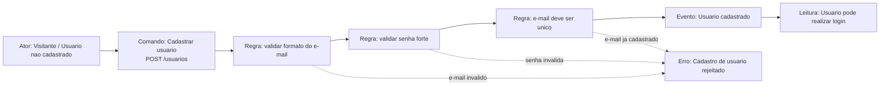
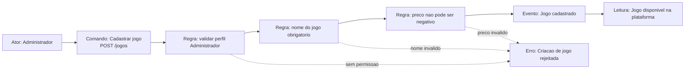
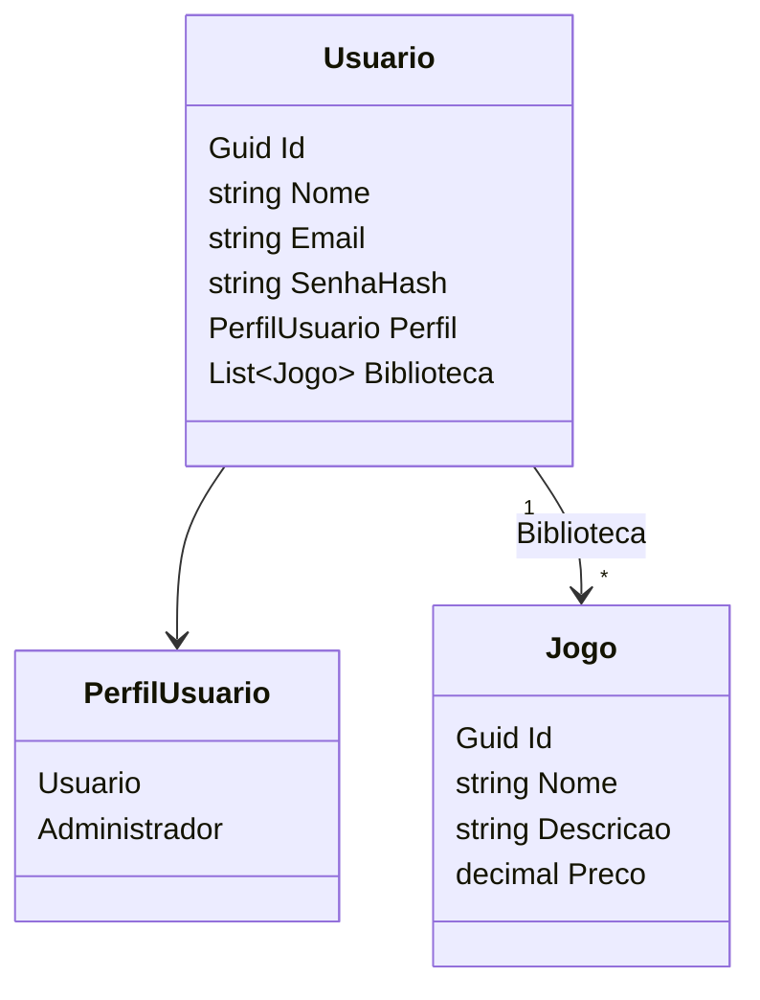

# Documentacao DDD - Event Storming

Projeto: FIAP Cloud Games - Fase 1

Esta documentacao modela o dominio do projeto utilizando Event Storming para mapear os fluxos de criacao de usuarios e criacao de jogos, conforme solicitado no Tech Challenge.

## Legenda

| Tipo | Significado |
| --- | --- |
| Ator | Pessoa ou perfil que inicia o fluxo |
| Comando | Acao solicitada para a API |
| Regra | Validacao ou regra de negocio |
| Evento | Algo importante que aconteceu no dominio |
| Erro | Fluxo alternativo quando uma regra nao e atendida |
| Leitura | Consulta ou disponibilidade de informacao |

## Linguagem Ubiqua

- Usuario: pessoa cadastrada na plataforma.
- Visitante: pessoa que ainda nao possui cadastro.
- Administrador: perfil autorizado a administrar usuarios e cadastrar jogos.
- Jogo: item digital disponivel na plataforma.
- Biblioteca: lista de jogos adquiridos por um usuario.
- Token JWT: credencial de autenticacao usada para acessar rotas protegidas.

## Fluxo 1 - Criacao de Usuarios

### Descricao do Fluxo

1. O visitante solicita o cadastro pelo endpoint `POST /usuarios`.
2. A API valida o formato do e-mail.
3. A API valida a seguranca da senha.
4. A API verifica se o e-mail ja esta cadastrado.
5. Se as regras forem atendidas, ocorre o evento `Usuario cadastrado`.
6. O usuario passa a poder realizar login e receber um token JWT.
7. Caso alguma regra falhe, o cadastro e rejeitado com mensagem de erro.

## Fluxo 2 - Criacao de Jogos

### Descricao do Fluxo

1. O administrador solicita o cadastro de jogo pelo endpoint `POST /jogos`.
2. A API valida se o token JWT pertence a um usuario com perfil `Administrador`.
3. A API valida se o nome do jogo foi informado.
4. A API valida se o preco nao e negativo.
5. Se as regras forem atendidas, ocorre o evento `Jogo cadastrado`.
6. O jogo fica disponivel para listagem na plataforma.
7. Caso alguma regra falhe, a criacao do jogo e rejeitada.

## Entidades do Dominio

## Regras de Negocio

- O usuario deve possuir nome, e-mail e senha.
- O e-mail deve ter formato valido.
- O e-mail deve ser unico.
- A senha deve possuir no minimo 8 caracteres, letras, numeros e caractere especial.
- Apenas administradores podem listar usuarios.
- Apenas administradores podem cadastrar jogos.
- O jogo deve possuir nome.
- O preco do jogo nao pode ser negativo.
- A biblioteca do usuario nao deve duplicar o mesmo jogo.

## Relacao com o Codigo

| Conceito DDD | Implementacao |
| --- | --- |
| Usuario | `src/FiapCloudGames.Api/Domain/Usuario.cs` |
| Jogo | `src/FiapCloudGames.Api/Domain/Jogo.cs` |
| PerfilUsuario | `src/FiapCloudGames.Api/Domain/PerfilUsuario.cs` |
| Regras de usuario | `src/FiapCloudGames.Api/Services/UsuarioService.cs` |
| Regras de jogo | `src/FiapCloudGames.Api/Services/JogoService.cs` |
| Persistencia | `src/FiapCloudGames.Api/Data/AppDbContext.cs` |
